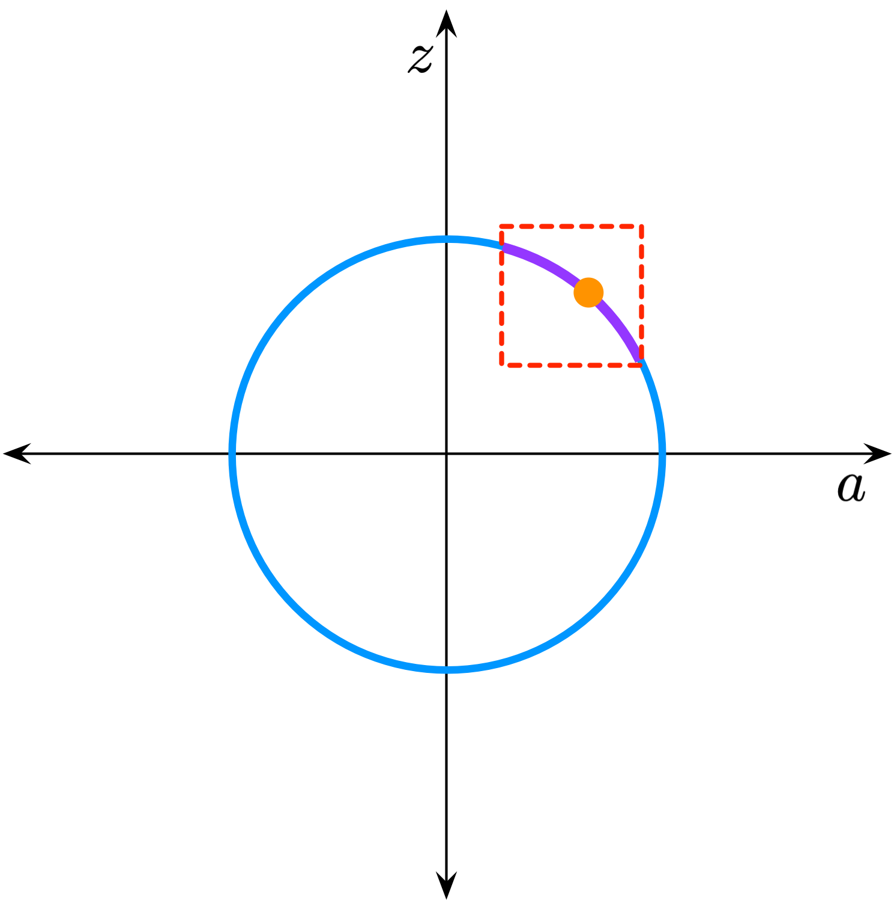

## implicit (automatic) differentiation

---
### the implicit function theorem

<style>
.container{
    display: flex;
	font-size: 20pt;
}
.col{
    flex: 1;
}
</style>

<div class="container">

<div class="col">
<ul>
<li>If:
  <ul>
  <li>$g = 0$ has a solution $x_0, a_0$, and</li>
  <li>$g$ is differentiable with respect to $x$,</li>
  </ul>
  </li>

<br/>
<li>Then there exists:
  <ul>
  <li>a map of $a$ near $a_0$ to $x$ near $x_0$,</li>
  <li>specifically sending $a_0 \mapsto x_0$,</li>
  <li>s.t. these all solve $g(x,a) = 0$</li>
  </ul>
  </li>

<br/>
<li>In other words:<br/>&nbsp;&nbsp;&nbsp;&nbsp;&nbsp;&nbsp;&nbsp;&nbsp;<strong>implicit differentiation works</strong></li>
</ul>

</div>

<div class="col">
$$g(x, a) = x^2 + a^2 - 1 = 0$$


<br/>
<span style="font-size: 14pt;"><strong>See:</strong> Kolter, Duvenaud, Johnson &ndash; Implicit Layers Tutorial</span><br/>
<span style="font-size: 14pt;"> &nbsp;&nbsp;&nbsp;&nbsp;&nbsp;&nbsp;&nbsp;&nbsp;&nbsp;&nbsp;&nbsp;&nbsp;&nbsp;&nbsp;&nbsp;&nbsp;&nbsp;&nbsp;
 (NeurIPS 2020, <a href="http://implicit-layers-tutorial.org/">implicit-layers-tutorial.org</a>)</span>
</div>

</div>

---
### what about implicit *automatic* differentiation?

---
### implicit autodiff example: solve Ax=b

Define: &nbsp;&nbsp;&nbsp; $\operatorname{solve}(A,b) = \\{ x \mid Ax=b \\}$

<br/>

Say $A$ and $b$ are both functions of some parameter $\theta$

What is &nbsp;&nbsp;&nbsp; $\frac{\partial}{\partial \theta} \operatorname{solve}(A, b)$ &nbsp;&nbsp;&nbsp;?

---
### implicit autodiff example: solve Ax=b

$$
\begin{align*}
  & Ax = b \\\\
  \\\\
  \implies& \frac{\partial A}{\partial \theta} x + A \frac{\partial x}{\partial \theta} = \frac{\partial b}{\partial \theta} \\\\
  \\\\
  \implies& \frac{\partial x}{\partial \theta} =
    \operatorname{solve}\left(A, \frac{\partial b}{\partial \theta} - \frac{\partial A}{\partial \theta} x \right)
\end{align*}
$$

<br/>
<center><strong>Jacobian of solve is solve!</strong></center>

---
### in jax: custom derivatives

```python [1-100|1-3|5-100|10-10|11-11|13-13]
@jax.custom_jvp
def solve(A, b):
  return long_iterative_solver(A, b)  # many operations
  
@solve.defjvp
def solve_jvp(primals, tangents):
  A, b = primals
  dA, db = tangents
  
  x  = solve(A, b)
  dx = solve(A, db - dA @ x)
  
  return x, dx
```
