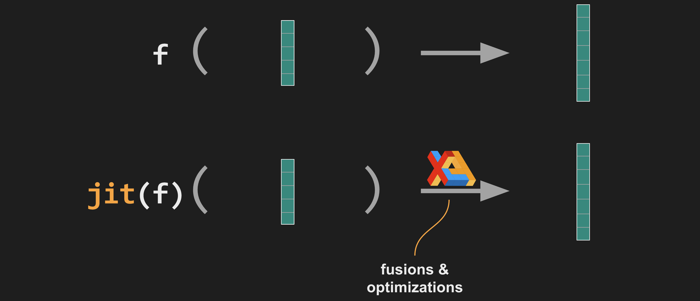
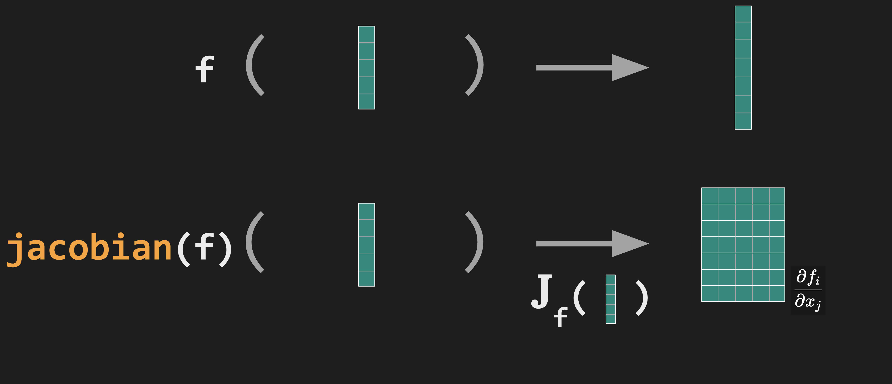

<style type="text/css">
.leftbox {
	text-align: left;
}
.greytxt {
	color: rgba(255, 255, 255, 0.5);
}
.slim {
    padding-bottom: 0; padding-top: 0;
	margin-bottom: 0; margin-top: 0;
	line-height: 10px;
}
.gdm { color: #0053d6; }
.orange { color: orange; }
.green  { color: #2ec410; }
.purple { color: #dc1fde; }
.reveal .agenda table th { border-bottom: none; }
.reveal .agenda table td { border-bottom: none; }
.xform { }
.smallertxt { font-size: 65% }
</style>

# jax 4 dc

<p style="color: orange;">L4DC 2023 tutorial</p>

<p style="font-size: 65%;">Roy Frostig, Sumeet Singh, <strong>Stephen Tu</strong></p>

<p style="font-size: 65%;">Google DeepMind</p>

---
## agenda

<div class="agenda">

| | |
|-----------|----------------------|
|*Prelude:* | JAX intro and basics |
|*Part I:*  | Control with JAX |
|           | <span class="purple">&mdash; &nbsp; *intermission* &nbsp; &mdash;</span> |
|*Part II:* | Fundamentals of trajectory optimization |
|

</div>

---

## jax basics
---
### what is jax?


JAX is a <strong style="color: orange">Python library</strong>
for high-performance <strong style="color: #2ec410;">array programming</strong>
and <strong style="color: #dc1fde;">machine learning</strong> research.

(And we will apply it to <strong class="orange">dynamics and control</strong> problems.)

---
### example: simplest neural network

<div class="leftbox" style="font-size: 80%;">
Using plain NumPy:
</div>

```python [1-100|1-1|3-7|9-100]
import numpy as np

def predict(params, inputs):
  for W, b in params:
    outputs = np.dot(inputs, W) + b
    inputs = np.tanh(outputs)   # inputs to the next layer
  return outputs                # no tanh activation on output

def loss(params, inputs, targets):        # squared loss
  preds = predict(params, inputs)
  return np.sum((preds - targets) ** 2)
```

---
### example: simplest neural network

<div class="leftbox" style="font-size: 80%;">
Using JAX:
</div>

```python [1-100|1-1|5-6|11-11|1-100]
import jax.numpy as jnp

def predict(params, inputs):
  for W, b in params:
    outputs = jnp.dot(inputs, W) + b
    inputs = jnp.tanh(outputs)  # inputs to the next layer
  return outputs                # no tanh activation on output

def loss(params, inputs, targets):        # squared loss
  preds = predict(params, inputs)
  return jnp.sum((preds - targets) ** 2)
```

<div class="agenda">
<div class="leftbox" style="font-size: 60%;">

| | | |
|-|-|-|
| <input checked="" type="checkbox" style="height: 20px; width: 20px"/> | <strong style="color: orange">Accelerate</strong> on GPU/TPU/CPU | with <code style="color: #2ec410;">jax.numpy</code> |

<!-- <p class=""><input checked="" type="checkbox" style="height: 20px; width: 20px"/> -->
<!--   &nbsp;&nbsp; <span class=""><strong style="color: orange">Accelerate</strong> on GPU/TPU/CPU with <code style="color: #2ec410;">jax.numpy</code></span></p> -->
</div>
</div>

---
### example: simplest neural network

```python [1-3|1-5|1-6|1-7]
from jax import jit, grad, vmap

def loss(params, inputs, targets): ...   # same loss

grad_loss        = grad(loss)
batch_grads      = vmap(grad_loss, in_axes=(None, 0, 0))
batch_grads_fast = jit(batch_grads)
```

<div class="agenda">
<div class="leftbox" style="font-size: 60%;">

| | | |
|-|-|-|
| <input checked="" type="checkbox" style="height: 20px; width: 20px"/> | <strong style="color: orange">Accelerate</strong> on GPU/TPU/CPU | with <code style="color: #2ec410;">jax.numpy</code> |
| <input checked="" type="checkbox" style="height: 20px; width: 20px"/> | <strong style="color: orange">Autodiff</strong> for gradients | with <code style="color: #2ec410;">jax.grad</code> |
| <input checked="" type="checkbox" style="height: 20px; width: 20px"/> | <strong style="color: orange">Auto-vectorize</strong> for scale | with <code style="color: #2ec410;">jax.vmap</code> |
| <input checked="" type="checkbox" style="height: 20px; width: 20px"/> | <strong style="color: orange">Compile</strong> for performance | with <code style="color: #2ec410;">jax.jit</code> |

<!-- <p class=""><input checked="" type="checkbox" style="height: 20px; width: 20px"/> -->
<!--   &nbsp;&nbsp; <span class=""><strong style="color: orange">Accelerate</strong> on GPU/TPU/CPU with <code style="color: #2ec410;">jax.numpy</code></span></p> -->
<!-- <p class=""><input checked="" type="checkbox" style="height: 20px; width: 20px"/> -->
<!--   &nbsp;&nbsp; <span class=""><strong style="color: orange">Autodiff</strong> for gradients with <code style="color: #2ec410;">jax.grad</code></span></p> -->
<!-- <p class=""><input checked="" type="checkbox" style="height: 20px; width: 20px"/> -->
<!--   &nbsp;&nbsp; <span class=""><strong style="color: orange">Compile</strong> end-to-end with <code style="color: #2ec410;">jax.jit</code></span></p> -->
<!-- <p class=""><input checked="" type="checkbox" style="height: 20px; width: 20px"/> -->
<!--   &nbsp;&nbsp; <span class=""><strong style="color: orange">Auto-vectorize</strong> with <code style="color: #2ec410;">jax.vmap</code></span></p> -->
</div>
</div>

---
### jax philosophy

Array programming and ML are about<br/>
<strong style="color: orange">expressing</strong> and
<strong style="color: #2ec410;">transforming</strong>
functions

```python[1-2|4-6]
# Express!
def loss(params, batch): ...

# Transform!
jit(vmap(grad(loss)))
pmap(hessian(loss))
```

<p class="">transformations <strong class="purple">compose</strong>!</p>

---
### jax transformations

Say you have a function <code class="orange">f</code>.

What <strong class="green">transformations</strong> can you apply to it?

---
### just-in-time compilation

<span class="green">``jax.jit``</span> &nbsp; &ndash; &nbsp; compile just-in-time



<div class="smallertxt leftbox">

* Compiles just-in-time, specializing to argument array shapes and types

* Optimizations, op fusions, and multi-device distribution &ndash; via XLA compiler

</div>

---
### automatic vectorization

<span class="green">``jax.vmap``</span> &nbsp; &ndash; &nbsp; vectorizing map


<div class="smallertxt leftbox">

* To scale up, we want to saturate memory, operate on many points at a time

* With vmap, write your function for one point, transform it to accept a batch

* No "outer loop" &ndash; ``vmap`` pushes the map down into vector operations

</div>

---
### vmap example: matrix multiply

```python[1-100|1-4|6-6|8-100]
def mat_vec_mul(m, v):
  assert m.ndim == 2  # m is a matrix
  assert v.ndim == 1  # v is a vector
  return m @ v
  
mat_mat_mul = vmap(mat_vec_mul, in_axes=(None, 1))

a = jnp.ones((3, 4))
b = jnp.ones((4, 7))
print(mat_mat_mul(a, b).shape)   # (3, 7)
```

<div class="smallertxt leftbox">

* Original <span class="green">``mat_vec_mul``</span> written for one "point" (vector)

* Resulting <span class="green">``mat_mat_mul``</span> issues a single matrix multiply, not a per-vector multiply

* Can <span class="green">``vmap``</span> through entire libraries, e.g. run parallel simulations

</div>

---
### parallelization

<span class="green">``jax.pmap``</span> &nbsp; &ndash; &nbsp; parallelizing map


<div class="smallertxt leftbox">

* Say we have multiple GPU cores, each holds an array slice

* Use <span class="green">``pmap``</span> for compiled SPMD-style parallelism on each device

</div>

---
### automatic differentiation

<span class="green">``jax.grad``</span>


<div class="smallertxt leftbox">

* Computes gradients using reverse-mode autodiff ("backprop")

</div>

---
### automatic differentiation

<span class="green">``jax.jacobian``</span>



<div class="smallertxt leftbox">

* Similar to <span class="green">``grad``</span>, just not restricted to scalar-valued functions

</div>

---
### automatic differentiation

<span class="green">``jax.hessian``</span>


<div class="smallertxt leftbox">

* Computes all second-order derivatives efficiently

* Implemented as a composition of two autodiff transformations

* Compose AD with itself $\implies$ derivatives to any order

</div>

---
### automatic differentiation

<span class="green">``jax.jvp``</span>


<div class="smallertxt leftbox">

* Short for "Jacobian-vector product"

* The basic *forward-mode* AD building block &ndash; input perturbations

</div>

---
### automatic differentiation

<span class="green">``jax.vjp``</span>


<div class="smallertxt leftbox">

* Short for "vector-Jacobian product"

* The basic *reverse-mode* AD building block &ndash; output perturbations

</div>

---
### and more

* Several other transformations

  * Automatic transposition of linear functions
  * Checkpointing, debugging, ...
  
* Today:
  <span class="green">``jit``</span>,
  <span class="green">``vmap``</span>, and
  <span class="green">``grad``</span> / <span class="green">``jacobian``</span>

---
### JAX is open source


<span class="purple" style="font-weight: bold;">github.com/google/jax</span>

<div class="smallertxt">

* Led by people at Google DeepMind

* Supports research across and outside Google

</div>

---
### Ecosystem


---
## agenda

<div class="agenda">

| | |
|-----------|----------------------|
|*Prelude:* | JAX intro and basics &nbsp; <input checked="" type="checkbox" style="height: 30px; width: 30px"/> |
|*Part I:*  | Control with JAX |
|           | <span class="purple">&mdash; &nbsp; *intermission* &nbsp; &mdash;</span> |
|*Part II:* | Fundamentals of trajectory optimization |
|

</div>

---
### Python reminders

<!-- * <span class="green">``a @ b``</span> &nbsp;&nbsp; is generalized dot / matmul -->

* <span class="green">``a ** b``</span> &nbsp;&nbsp; is exponentiation

* <span class="green">``transform``</span>``(f)(x, y, z)``

* <span class="green">``partial``</span>``(f, ...)`` is partial application of ``f``

```python
from functools import partial

def f(x, y): ...
g = partial(f, 3)       # g(5) == f(3, 5)

def f(x, z=7): ...
g = partial(f, z=8)     # g(5) == f(5, z=8)
```
