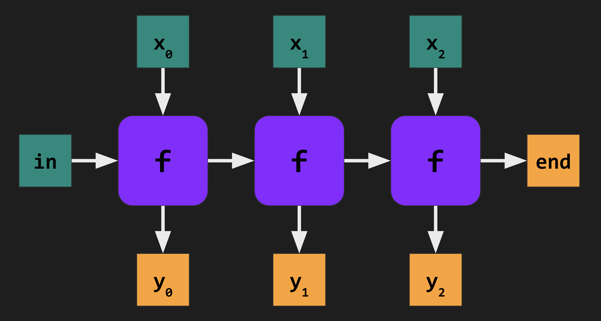
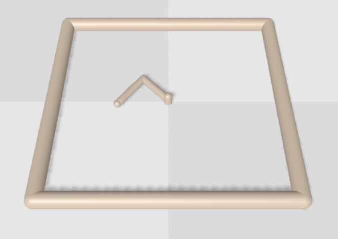
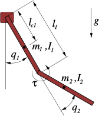

## basics of optimal control

---
### key mathematical abstractions

- <!-- .element: class="fragment" -->
  <span class="green">**dynamics**</span> $f : \mathrm{Time} \times \mathrm{State} \times \mathrm{Input} \rightarrow \mathrm{State}$.
- <!-- .element: class="fragment" -->
  <span class="green">**stage cost**</span> $c : \mathrm{Time} \times \mathrm{State} \times \mathrm{Input} \rightarrow \mathbb{R}$.
- <!-- .element: class="fragment" -->
  <span class="green">**terminal cost**</span> $c_f: \mathrm{Time} \times \mathrm{State} \rightarrow \mathbb{R}$.

---
### optimal control formulation

The objective of *(discrete-time)* optimal control is to solve the following
optimization problem:
$$
\begin{align*}
&\min_{\\{{\color{lightblue}u_t}\\}} \sum_{t=0}^{T-1} c(t, x_t, {\color{lightblue}u_t}) + c_f(T, x_T) \\\\
&\~\text{s.t.}\~\~x_{t+1} = f(t, x_t, {\color{lightblue}u_t}), \quad t \in [T-1] \\\\
&\~\~\~\~\~\~\~\~\\, x_0\~\text{given}.
\end{align*}
$$

---
### let's build the key primitives

---

**Follow along at:**

[github.com/google/trajax/tree/main/notebooks/l4dc](https://github.com/google/trajax/tree/main/notebooks/l4dc)

<center></center>

---
### rollout

<span style="color: orange">**Input:**</span> <!-- .element: class="fragment" -->
1. a dynamics function $f$, <!-- .element: class="fragment" -->
2. a sequence of inputs $U = \\{u_t\\} \subset \mathbb{R}^d$, and <!-- .element: class="fragment" -->
3. a starting state $x_0 \in \mathbb{R}^n$. <!-- .element: class="fragment" -->

<p class="fragment"><strong style="color: orange">Output:</strong> The corresponding \(x_1, \dots, x_T \in \mathbb{R}^n\) in 
$$x_{t+1} = f(t, x_t, u_t).$$
</p>

---
### scan

* We will use JAX's <span class="green">``scan``</span> to implement rollouts

* <span class="green">``scan``</span>``(f, init, xs)`` performs loop-with-carry:



* Faster <strong style="color: orange">autodiff</strong> and
  <strong style="color: orange">compilation</strong> than Python <span class="green">``for``</span>


---
### rollout

$$
x_{t+1} = f(t, x_t, u_t), \quad t \in [0, T-1].
$$

```python [1-100|13-13|8-11|14]
# f(t, x, u)
Dynamics = Callable[[Scalar, Array, Array], Array]

def rollout(dynamics: Dynamics,
            U: Array, x0: Array) -> Array:
  T = len(U)

  def step(x, args):
    t, u = args
    x = dynamics(t, x, u)
    return x, x                 # carry, output

  _, X = lax.scan(step, x0, [jnp.arange(T), U])
  return X                      # shape (T, n)
```
<!-- .element: style="height: 410px;" -->

---
### an aside: c2d dynamics

C2D is a <span style="color: orange">*functional transform*</span>:
```python [1-100|1-2|4-12|14-15]
def euler(dynamics: Dynamics, dt: float) -> Dynamics:
  return lambda t, x, u: x + dt * dynamics(t * dt, x, u)

def rk4(dynamics: Dynamics, dt: float) -> Dynamics:
  def integrator(t, x, u):
    dt2 = dt / 2.0
    k1 = dynamics(t * dt, x, u)
    k2 = dynamics(t * dt, x + dt2 * k1, u)
    k3 = dynamics(t * dt, x + dt2 * k2, u)
    k4 = dynamics(t * dt, x + dt * k3, u)
    return x + (dt / 6.0) * (k1 + 2 * k2 + 2 * k3 + k4)
  return integrator

def cts_dynamics(t, x, u): ...
dynamics = rk4(cts_dynamics, dt=0.1)
```
<!-- .element: style="height: 430px;" -->

---
### trajectory cost

<span style="color: orange">**Input:**</span> <!-- .element: class="fragment" -->
1. stage/terminal cost functions $(c, c_f)$, <!-- .element: class="fragment" -->
2. a sequence of inputs $U = \\{u_t\\}$, and <!-- .element: class="fragment" -->
3. a trajectory $X = \\{x_t\\}$, <!-- .element: class="fragment" -->

<p class="fragment"><strong style="color: orange">Output:</strong> The (scalar) cost of this trajectory:
$$
    J(U, X) = \sum_{t=0}^{T-1} c(t, x_t, u_t) + c_f(T, x_T).
$$
</p>

---
### trajectory cost

Let us bundle the stage and terminal costs:

```python []
from dataclasses import dataclass

# c(t, x, u)
StageCost = Callable[[Scalar, Array, Array], float]
# c_f(t, x)
TerminalCost = Callable[[Scalar, Array], float]

@dataclass
class Cost:
  stage_cost: StageCost
  terminal_cost: TerminalCost
```

---
### trajectory cost

$$
    J(U, X) = \sum_{t=0}^{T-1} c(t, x_t, u_t) + c_f(T, x_T).
$$

```python [1-100|6-7|8-9|10|11]
def trajectory_cost(
    cost: Cost, U: Array, x0: Array, X: Array
) -> float:
  T = len(U)
  time_steps = jnp.arange(T)
  X = jnp.concatenate(
      (x0[jnp.newaxis, :], X), axis=0)  # (T + 1, n)
  stage_cost = jnp.sum(
      vmap(cost.stage_cost)(time_steps, X[:-1], U))
  terminal_cost = cost.terminal_cost(T, X[-1])
  return stage_cost + terminal_cost
```

---
### objective function

We now compose `rollout` and `trajectory_cost` to write an objective
function for optimal control.

```python [1-100|5|6]
def objective(
    dynamics: Dynamics, cost: Cost,
    U: Array, x0: Array
) -> float:
  X = rollout(dynamics, U, x0)
  return trajectory_cost(cost, U, x0, X)
```

---
### brax: differentiable physics

We <!-- .element: class="fragment" -->
will use <span class="green">`brax`</span>, a Jax-based physics engine (similar to MuJoCo/PyBullet),
to supply dynamics functions.

A <!-- .element: class="fragment" -->
key abstraction in <span class="green">`brax`</span> is the notion of an *environment*.

```python []
from brax import envs
from brax.envs import Env

reacher_env = envs.get_environment(
    env_name='reacher',    # 'reacher', 'ant', ...
    backend='positional',  # 'generalized', 'positional', ...
)
```
<!-- .element: class="fragment" -->

---
### brax reacher env

We fix a single environment, the <span style="color: orange">`reacher`</span> env.



We now focus on writing `dynamics` and `cost` for this environment.

---
### brax state

The <!-- .element: class="fragment" --> underlying state that backs an `Env` instance is the following dataclass
containing <span style="color: orange">*derived*</span> information:
```python [1-100|3-5|7-9]
@dataclass
class State:
  # generalized coordinates
  q: jp.ndarray
  qd: jp.ndarray

  # derived from (q, qd) using forward kinematics
  x: Transform
  xd: Motion

  # contact information
  contact: Optional[Contact]
```
<!-- .element: class="fragment" -->

---
### brax state <-> generalized coordinates

We need the following conversions to vectorize the state:

```python [1-100|3-4|6-9]
from brax import State

def state_to_coords(state: State) -> Array:
  return jnp.concatenate((state.q, state.qd))

def coords_to_state(env: Env, coords: Array) -> State:
  q, qd = jnp.split(coords, [env.sys.q_size()])
  return env.pipeline_init(q, qd)
```

---
### reacher dynamics function

```python [1-100|1-5|7]
def brax_dynamics(
    env: Env, t: Scalar, x: Array, u: Array) -> Array:
  x = coords_to_state(env, x)
  x = env.pipeline_step(x, u)
  return state_to_coords(x)

dynamics = partial(brax_dynamics, reacher_env)
```

---
### reacher cost function

```[1-100|16-17|14-15]
### Observation Space

The observation is a `ndarray` with shape `(11,)` where the elements
correspond to the following:

| Num | Observation                                     | Unit                     |
|-----|-------------------------------------------------|--------------------------|
| 0   | cosine of the angle of the first arm            | unitless                 |
| 1   | cosine of the angle of the second arm           | unitless                 |
| 2   | sine of the angle of the first arm              | unitless                 |
| 3   | sine of the angle of the second arm             | unitless                 |
| 4   | x-coordinate of the target                      | position (m)             |
| 5   | y-coordinate of the target                      | position (m)             |
| 6   | angular velocity of the first arm               | angular velocity (rad/s) |
| 7   | angular velocity of the second arm              | angular velocity (rad/s) |
| 8   | x-value of position_fingertip - position_target | position (m)             |
| 9   | y-value of position_fingertip - position_target | position (m)             |
| 10  | z-value of position_fingertip - position_target | position (m)             |
```
<!-- .element: style="height: 520px; width: 1270px;" -->

---
### reacher cost function

```python
@dataclass
class ReacherCostParams:
  # stage cost weights
  stage_pos: float = 10.0
  stage_vel: float = 1.0
  stage_act: float = 0.1

  # terminal cost weights
  term_pos: float = 100.0
  term_vel: float = 10.0
```

---
### reacher cost

```python [1-100|4-6|8-9|11-12|14-15|16]
def reacher_stage_cost(
  t: Scalar, x: Array, u: Array, *, params: ReacherCostParams
) -> float:
  x = coords_to_state(reacher_env, x)
  obs = reacher_env._get_obs(x)  # get access to goal
  state_cost = 0.0

  # distance to goal
  state_cost += params.stage_pos * jnp.sum(obs[8:10] ** 2)

  # angular velocity of arm
  state_cost += params.stage_vel * jnp.sum(obs[6:8] ** 2)

  # actuation penalty
  act_cost = params.stage_act * jnp.sum(u ** 2)
  return state_cost + act_cost
```
<!-- .element: style="height: 460px;" -->

---
### reacher cost

```python [1-100|1|3-6|8-10]
def reacher_term_cost(t, x, *, params): ...

params = ReacherCostParams()
cost = Cost(
    partial(reacher_stage_cost, params=params),
    partial(reacher_term_cost, params=params))

x0 = ...  # fixed for now
obj = partial(objective, dynamics, cost, x0=x0)
# obj(U) = objective(dynamics, cost, U, x0=x0)
```

---
### roadmap

<ol>
<li><p><strong>First-order, gradient based solvers.</strong></p>
</li>
<div style="color: rgba(255, 255, 255, 0.5);">
<li><p>Iterative LQR with <code>trajax</code>.</p>
<ul class="smallertxt">
<li>AD through cost/dynamics.</li>
</ul>
</li>

<li><p><code>vmap</code>-ing iLQR.</p>
  <ul class="smallertxt">
    <li><p>Over different initial conditions.</p></li>
    <li><p><code>vmap</code> over <code>vmap</code> over iLQR for robust cost parameter search.</p></ul>
  </ul>
</li>

<li><p>Sensitivity analysis for iLQR solutions.</p>
<ul class="smallertxt">
<li>AD through solutions via implicit function theorem.</li>
</ul>
</li>
</div>
</ol>

---
### gradient methods

Vanilla <!-- .element: class="fragment" -->
gradient descent implements:
$$
    U_{t+1} = U_t - \eta \nabla J(U_t),
$$
where $J(\cdot)$ represents the objective function.

Many variants: momentum, Adam, AdaGrad, etc.
<!-- .element: class="fragment" -->

We use <span class="green">`optax`</span> to abstract over specific update rules.
<!-- .element: class="fragment" -->

---
### gradient methods

First-order <!-- .element: class="fragment" -->
methods can be abstracted as:
$$
    (U_{t+1}, \zeta_{t+1}) = \mathrm{update}(U_t, \zeta_t, \nabla J(U_t)).
$$

```python [1-100|9|10]
import optax
from optax import OptState, TransformUpdateFn

def gradient_step(
    update: TransformUpdateFn,
    U: Array,
    opt_state: OptState
) -> tuple[float, Array, OptState]:
  v, g = value_and_grad(obj)(U)
  U, opt_state = optax_step(update, U, opt_state, g)
  return v, U, opt_state
```
<!-- .element: class="fragment" -->


<!--
### gradient methods

$$
    (U_{t+1}, \zeta_{t+1}) = \mathrm{update}(U_t, \zeta_t, \nabla J(U_t)).
$$

```python [1-100|7|8-9|10]
def optax_step(
    update: TransformUpdateFn,
    params: Array,
    opt_state: OptState,
    gradient: Array
) -> tuple[Array, OptState]:
  updates, opt_state = update(gradient, opt_state, params)
  # params += updates
  params = optax.apply_updates(params, updates)
  return params, opt_state
```
-->

---
### gradient methods

We can now write our first trajectory optimizer.
<!-- .element: class="fragment" -->

```python [1-100|4-5|7|9-11]
# initialize
U = ...  # jnp.zeros((T, d)), random init, etc.

opt = optax.adam(learning_rate=1e-3)  # or optax.sgd, ...
opt_state = opt.init(U)

step = jit(partial(gradient_step, opt.update))

for iteration in range(100):
  v, U, opt_state = step(U, opt_state)
  print(f"iteration={iteration}, cost={v}")
```
<!-- .element: class="fragment" -->

---
### demo

<iframe data-src="optax_adam.html" width="900" height="600"></iframe>

---
### compatibility with existing libraries

We <!-- .element: class="fragment" -->
can also "drop in" our objective function to Python optimization libraries that accept functions as arguments.

---
### scipy L-BFGS

```python [1-100|3|5-11|7|8|9-11|13-15]
import scipy as sp

value_and_grad_obj = jit(value_and_grad(obj))

def scipy_obj(flat_U: np.ndarray) -> tuple[float, np.ndarray]:
  """Interface between L-BFGS and Jax."""
  U = flat_U.reshape((T, d))  # unflatten
  v, g = value_and_grad_obj(U)
  return (
    float(v),
    np.array(jax.device_get(g), dtype=np.float64).flatten())

flat_U, f_star, _ = sp.optimize.fmin_l_bfgs_b(
    scipy_obj, jax.device_get(U.flatten()))
U = flat_U.reshape(U.shape)
```
<!-- .element: style="height: 430px;" -->

---
### demo

<iframe data-src="scipy_lbfgs.html" width="900" height="600"></iframe>

---
### roadmap

<ol>
<div style="color: rgba(255, 255, 255, 0.5);"> 
<li><p> First-order, gradient based solvers. <input checked="" type="checkbox" style="height: 30px; width: 30px">
</p> 
</li>
</div>
<li><p><strong>Iterative LQR with <code class="green">trajax</code>.</strong></p>
<ul class="smallertxt">
<li><p style="color: orange">AD through cost/dynamics.</p></li>
</ul>
</li>
<div style="color: rgba(255, 255, 255, 0.5);">
<li><p><code>vmap</code>-ing iLQR.</p>
  <ul class="smallertxt">
    <li><p>Over different initial conditions.</p></li>
    <li><p><code>vmap</code> over <code>vmap</code> over iLQR for robust cost parameter search.</p></ul>
  </ul>
</li>
<li><p>Sensitivity analysis for iLQR solutions.</p>
<ul class="smallertxt">
<li>AD through solutions via implicit function theorem.</li>
</ul>
</li>
</div>
</ol>

---
### iterative lqr

A more robust and stable method is known as <span class="green">*iterative LQR*</span>, which is based
on sequential <span style="color: orange">linearization</span> of the dynamics and 
<span style="color: orange">quadratization</span> of the cost.
<!-- .element: class="fragment" -->

---
### review: lqr

LQR <!-- .element: class="fragment" --> is the optimal control problem with:
$$
\begin{align*}
  f(t, x, u) &= A_t x + B_t u &&\text{{\color{lightgrey}(linear dynamics)}}, \\\\
  c(t, x, u) &= \frac{1}{2} \begin{bmatrix} x_t \\\\ u_t \end{bmatrix}^{\mathsf{T}}  \begin{bmatrix} Q_t & S_t \\\\ S_t^{\mathsf{T}} & R_t \end{bmatrix}  \begin{bmatrix} x_t \\\\ u_t \end{bmatrix} &&\text{{\color{lightgrey}(quadratic cost)}} \\\\
  &\qquad + q_t^{\mathsf{T}} x_t + r_t^{\mathsf{T}} u_t.
\end{align*}
$$

LQR <!-- .element: class="fragment" --> is solved by <span style="color: orange">backward Ricatti iteration</span>,
the optimal control is $u_t = K_t x_t + k_t$ for
gains $\\{K_t, k_t\\}$.

---
### ilqr in a nutshell

Repeat: <!-- .element: class="fragment" -->
<ul>
<li class="fragment"><strong style="color: orange">Linearize</strong> the dynamics and <strong style="color: orange">quadratize</strong> the cost around the current trajectory.</li>
<li class="fragment"><strong style="color: orange">Solve</strong> resulting LQR problem for gains.</li>
<li class="fragment"><strong style="color: orange">Update</strong> trajectory using computed gains via line-search.</li>
</ul>

More details to come in Part II.
<!-- .element: class="fragment" -->

---
### linearization/quadratization

Fix <!-- .element: class="fragment" -->
a nominal trajectory $\\{\bar{x}_t\\}, \\{\bar{u}_t\\}$.

<p class="fragment">
<span style="color: orange">Linearized</span> dynamics:
$$
A_t = \frac{\partial f}{\partial x}(t, \bar{x}_t, \bar{u}_t), \,
B_t = \frac{\partial f}{\partial u}(t, \bar{x}_t, \bar{u}_t).
$$
</p>

<p class="fragment">
<span style="color: orange">Quadratized</span> cost:
  \[\begin{aligned}
  \begin{bmatrix} q_t \\ r_t \end{bmatrix} = \nabla_{(x, u)} c(t, \bar{x}_t, \bar{u}_t), \,
  \begin{bmatrix} Q_t &amp; S_t \\ * &amp; R_t \end{bmatrix}  = \nabla^2_{(x, u)} c(t, \bar{x}_t, \bar{u}_t).
  \end{aligned} \]
</p>

---
### linearized dynamics

$$
A_t = \frac{\partial f}{\partial x}(t, \bar{x}_t, \bar{u}_t), \\,
B_t = \frac{\partial f}{\partial u}(t, \bar{x}_t, \bar{u}_t).
$$

```python [1-100|5-9]
# current trajectory
X, U = ...
time_steps = jnp.arange(len(U))

# linearize along trajectory
A = vmap(jacobian(dynamics, argnums=1))(  # (T, n, n)
    time_steps, X, U)
B = vmap(jacobian(dynamics, argnums=2))(  # (T, n, d)
    time_steps, X, U)
```

---
### quadratized cost

<p>
  \[\begin{aligned}
  \begin{bmatrix} q_t \\ r_t \end{bmatrix} = \nabla_{(x, u)} c(t, \bar{x}_t, \bar{u}_t), \,
  \begin{bmatrix} Q_t &amp; S_t \\ * &amp; R_t \end{bmatrix} = \nabla^2_{(x, u)} c(t, \bar{x}_t, \bar{u}_t).
  \end{aligned} \]
</p>

```python [1-100|1-7|9-12|14-19]
n = X.shape[1]

def stage_cost_stacked(xu: Array, t: Scalar) -> float:
  x, u = jnp.split(xu, [n])
  return cost.stage_cost(t, x, u)

XU = jnp.concatenate((X, U), axis=1)  # (T, n + d)

# (T, n + d)
qr = vmap(grad(stage_cost_stacked))(
    XU, time_steps)
q, r = jnp.split(qr, [n], axis=1)

# (T, n + d, n + d)
H = vmap(hessian(stage_cost_stacked))(
    XU, time_steps)
Q = H[:, :n, :n]; R = H[:, n:, n:]; S = H[:, :n, n:]
```
<!-- .element: style="height: 490px;" -->

---
### trajax in action

```python [1-100|3-10|12-16|18-20]
from trajax.optimizers import ilqr

# trajax does not delineate between stage/terminal
def trajax_cost(
    x: Array, u: Array, t: Scalar
) -> float:
  return jnp.where(
    t == T,
    cost.terminal_cost(t, x),
    cost.stage_cost(t, x, u))

def trajax_dynamics(
    x: Array, u: Array, t: Scalar
) -> Array:
  # (x, u, t) -> (t, x, u)
  return dynamics(t, x, u)

# algorithmic details in part II
ilqr_solve = partial(ilqr, trajax_cost, trajax_dynamics)
X, U, obj, *_ = ilqr_solve(x0, U)
```
<!-- .element: class="fragment" style="height: 570px;" -->

---
### demo

<iframe data-src="trajax_ilqr.html" width="900" height="600"></iframe>

---
### roadmap

<ol>
<div style="color: rgba(255, 255, 255, 0.5);"> 
<li><p> First-order, gradient based solvers. <input checked="" type="checkbox" style="height: 30px; width: 30px">
</p> 
</li>
<li><p>Iterative LQR with <code>trajax</code>. <input checked="" type="checkbox" style="height: 30px; width: 30px">
</p>
<ul class="smallertxt">
<li>AD through cost/dynamics.</li>
</ul>
</li>
</div>

<li><p><code>vmap</code>-ing iLQR.</p>
  <ul class="smallertxt">
    <li><p style="color: orange">Over different initial conditions.</p></li>
    <li><p style="color: orange"><code>vmap</code> over <code>vmap</code> over iLQR for robust cost parameter search.</p></ul>
  </ul> 
</li>

<div style="color: rgba(255, 255, 255, 0.5);">
<li><p>Sensitivity analysis for iLQR solutions.</p>
<ul class="smallertxt">
<li>AD through solutions via implicit function theorem.</li>
</ul>
</li>
</div>

</ol>

---
### vmapping ilqr

As an example, suppose we want to solve reacher
from a set of varying initial conditions $x_0$.

```python [1-100|1|3-5]
x0s, Us = ...

Xs, Us, objs, *_ = vmap(ilqr_solve)(x0s, Us)
```

---
### cost param optimization with vmap

We <!-- .element: class="fragment" --> can `vmap` 
over ICs and cost parameters to select 
the parameters that are the <span style="color: lightblue">**most robust**</span> 
over a set of ICs.

<!--
```python []
def make_trajax_cost(cost: Cost):
  def trajax_cost(x: Array, u: Array, t: Scalar) -> float:
    return jnp.where(
        t == T,
        cost.terminal_cost(t, x),
        cost.stage_cost(t, x, u))
  return trajax_cost
```
-->

---

```python [1-100|4-7|8-9|10-14|15-19|20-21]
def meta_cost(
    params: ReacherCostParams, x0s: Array
) -> float:
  # rebind cost params
  trajax_cost = make_trajax_cost(Cost(
      partial(reacher_stage_cost, params=params),
      partial(reacher_terminal_cost, params=params)))
  # initialize with some strategy
  U = ...  # jnp.zeros((T, d))
  # vmap over the x0s
  ilqr_solve = partial(
      ilqr, trajax_cost, trajax_dynamics)
  # Xs: (len(x0s), T + 1, n)
  Xs, *_ = vmap(ilqr_solve, in_axes=(0, None))(x0s, U)
  # convert final states to observations
  states = vmap(partial(coords_to_state, reacher_env))(
      Xs[:, -1, :])
  # obs: (len(x0s), obs_dim)
  obs = vmap(reacher_env._get_obs)(states)
  # compute the max goal error across x0s
  return jnp.max(jnp.sum(obs[:, 8:10] ** 2, axis=1))
```
<!-- .element: style="height: 600px;" -->

---
```python [1-100|1-5|7|8-9]
def reacher_cost_from_weight(w: float) -> ReacherCostParams:
  return ReacherCostParams(term_pos=w)

weights = jnp.array([100.0, 500.0, 1000.0])
all_params = vmap(reacher_cost_from_weight)(weights)

vmap_meta_cost = vmap(meta_cost, in_axes=(0, None))
meta_costs, _ = vmap_meta_cost(all_params, x0s)
best_cost_idx = jnp.argmin(meta_costs)
```
---
### demo

> tab to notebook and run reacher meta cost param search

---
### roadmap

<ol>
<div style="color: rgba(255, 255, 255, 0.5);"> 
<li><p> First-order, gradient based solvers. <input checked="" type="checkbox" style="height: 30px; width: 30px">
</p> 
</li>
<li><p>Iterative LQR with <code>trajax</code>. <input checked="" type="checkbox" style="height: 30px; width: 30px">
</p>
<ul class="smallertxt">
<li>AD through cost/dynamics.</li>
</ul>
</li>


<li><p><code>vmap</code>-ing iLQR. <input checked="" type="checkbox" style="height: 30px; width: 30px"></p>
  <ul class="smallertxt">
    <li><p>Over different initial conditions.</p></li>
    <li><p><code>vmap</code> over <code>vmap</code> over iLQR for robust cost parameter search.</p></ul>
  </ul>
</li>
</div>

<li><p>Sensitivity analysis for iLQR solutions.</p>
<ul class="smallertxt">
<li><p style="color: orange">AD through solutions via implicit function theorem.</p></li>
</ul>
</li>

</ol>


---
### sensitivity analysis of ilqr solutions

We now look at an advanced feature of <span class="green">`trajax`</span>'s iLQR:
differentiating solutions w.r.t.
<span style="color: lightblue">**parameters of the dynamics and cost**</span>.
<!-- .element: class="fragment" -->

<p class="fragment">
To simplify things, we consider <span style="color: orange">acrobot dynamics</span>:<br/>

</p>

---
### acrobot sensitivity analysis

**Q:** Which <span style="color: lightblue">dynamics parameter</span> is the <span style="color: orange">optimal control
effort</span> $\sum_{t=0}^{T-1} \\|u_t\\|^2$ most sensitive to?
<!-- .element: class="fragment" -->

```python [1-100|3-5|7-15|8-10|11-12|13-14|15]
from trajax.integrators import euler

def acrobot_cost(x, u, t): ...
def acrobot_cts_dynamics(x, u, t, params):
  """Sec. 3.1 in http://underactuated.mit.edu/acrobot.html"""

def optimal_control_effort(dynamics_params) -> float:
  # bind dynamics_params
  dynamics = partial(
      acrobot_cts_dynamics, params=dynamics_params)
  # c2d conversion
  dynamics = euler(dynamics, dt=0.1)  # or rk4, ...
  _, U, *_ = ilqr(
      acrobot_cost, dynamics, x0, U)
  return jnp.sum(U ** 2)
```
<!-- .element: class="fragment" style="height: 430px;" -->

---
### acrobot sensitivity analysis

**Q:** Which <span style="color: lightblue">dynamics parameter</span> is the <span style="color: orange">optimal control
effort</span> $\sum_{t=0}^{T-1} \\|u_t\\|^2$ most sensitive to?

```python [1-100|5-6]
# (LINK_MASS_1, LINK_MASS_2, LINK_LENGTH_1,
#  LINK_COM_POS_1, LINK_COM_POS_2, LINK_MOI_1, LINK_MOI_2)
dynamics_params = (1.0, 1.0, 1.0, 0.5, 0.5, 1.0, 1.0)

# sensitivity of control effort to each dynamics param
grad(optimal_control_effort)(dynamics_params)
```

<center><p class="fragment fade-up">&#129327; &#129327; &#129327;</p></center>

<!-- .element: class="fragment" -->

---
### demo

> tab to notebook and run acrobot sensitivity demo
